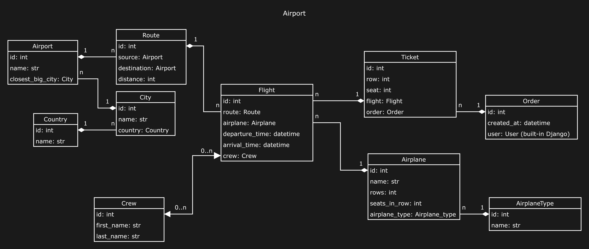

# Airport API Service
> **Welcome to the Airport API Service:** a system for tracking flights from airports across the globe.

###### The Airport API Service is a Django-based project designed for efficient management and tracking of flights from airports worldwide.This system facilitates efficient coordination and information management. With its well-structured features, the Airport API Service enables users to handle various aspects of the aviation ecosystem.

## Key Features

* **Authentication:** Users are authenticated using JWTs, which are issued upon successful login and provide secure access.
* **Admin Panel:** Admins can easily add, edit, and delete data, ensuring efficient control over the application.
* **Documentation:** Comprehensive API documentation is available through the Swagger UI.
* **Airplane Management:** Define and categorize different types of airplanes, capturing essential details such as capacity and images.
* **Crew Management:** Manage crew members, including their first and last names.
* **Location Handling:** Record information about countries and cities, associating airports with their closest big city.
* **Airport Details:** Store comprehensive data about airports, including their names, associated cities, and images.
* **Route Definition:** Define routes between source and destination airports, aiding in the organization of flight connections.
* **Flight Tracking:** Monitor flights with detailed information about the assigned route, airplane, departure, and arrival times. Additionally, manage the crew assigned to each flight.
* **Order and Ticket System:** Record and manage orders made by users, and handle tickets for specific flights and orders, including row and seat details.

## DB structure 



## Installation
### Using GitHub

Ensure you have `Python 3` installed.
Install `PostgreSQL` and create db.

```bash
git clone https://github.com/o-davydova/Airport-API-Service
cd Airport-API-Service
python3 -m venv venv
source venv/Scripts/activate
pip install -r requirements.txt
set DJANGO_SECRET_KEY=<your secret key>
set DJANGO_DEBUG=<your debug value>
set DJANGO_ALLOWED_HOSTS=<your allowed hosts>
set POSTGRES_HOST=<your Postgres host>
set POSTGRES_DB=<your Postgres database>
set POSTGRES_USER=<your Postgres user>
set POSTGRES_PASSWORD=<your Postgres password>
python manage.py migrate
python manage.py runserver
```

### Run with docker

`Docker` should be installed.

```
docker-compose build
docker-compose up
```

## Getting access
- create a user via **/api/user/register**
- get access token via **/api/user/token**
